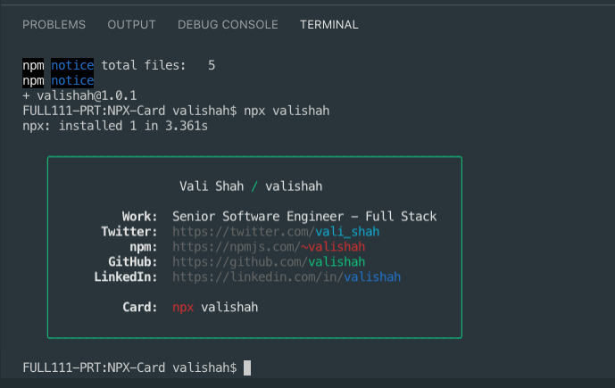

Personalised business card as a npm module. 

### Usage
Via npx:
```
$ npx valishah
```

**Note:** Not including how to use it globally because I'm not sure why you'd want this as a global command. That'd be creepy.

Here is how it will look like

